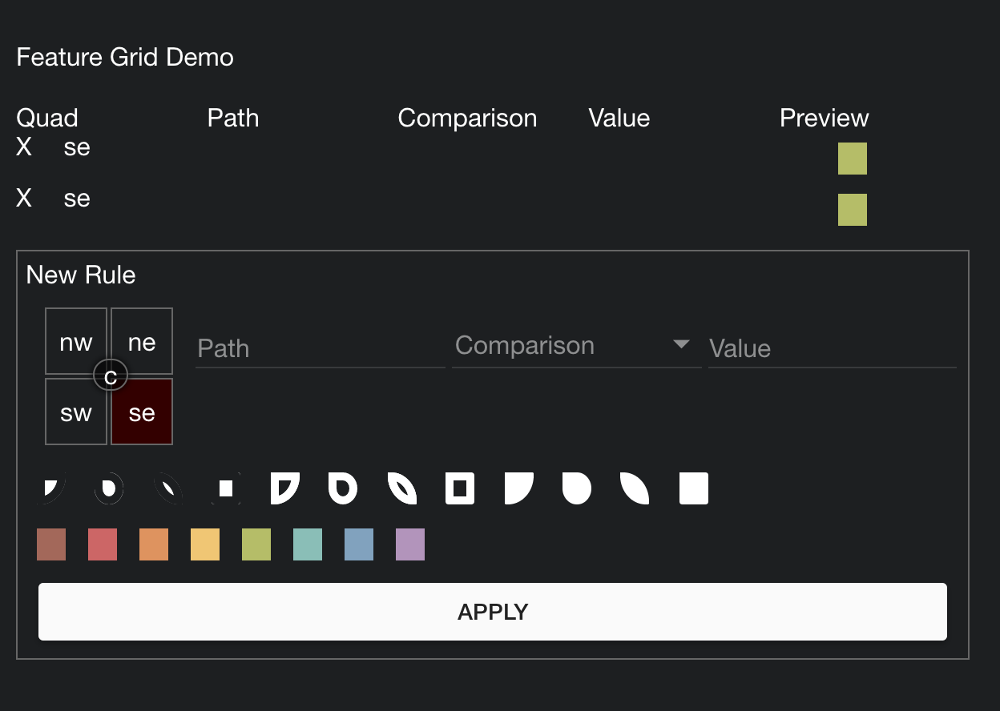

This Demo consist of 2 reusable components

Setup

```

npm install -g http-server

http-server /COMPLETE_PATH
Eg: http-server /Users/userName/project_stuff/RecordQue

open server URL from terminal to browser appending with "/demo.html"
Eg: http://192.168.0.101:8080/demo.html

```

# Feature Grid Modal
Visual representation for recordQue configurations of different stream sources



```html

<link rel="stylesheet" type="text/css" href="recordQue.css">

<div>
  <feature-grid></feature-grid>
</div>

<script type="text/javascript" src="./src/constants/feature-grid-constant.js"></script>
<script type="text/javascript" src="featureGrid.js"></script>

```
```javascript

var app = angular.module('AppName', ['ngFeatureGrid']);

Events used to send and receive data are:

Send Data to this directive:
$rootScope.$broadcast("SHOW_RECORDQUE_RULES", recordQueDataArray);

Receive Data from this directive:
$rootScope.$on("SAVE_RECORDQUE_RULES",function (event, recordQueDataArray) {
  //DO your stuff here
});

```

# RecordQue
a visual design language for borders to represent categories and values and reduce/expand ot an icon representation


```html

<link rel="stylesheet" type="text/css" href="recordQue.css">

<record-que d="{nw:'shape mod color',ne:'shape mod color',sw:'shape mod color',se:'shape mod color', c:'fa-icon color'}"></record-que>

<script type="text/javascript" src="recordQue.js"></script>

```
```javascript

var app = angular.module('AppName', ['ngRecordQue']);

```

## Shapes

Each of the shapes mods and colors have a class

1. Square
2. Pie
3. Leaf
4. Drop

## Mods

1. Cutout : a smaller disconnected version
1. Hollow
1. Solid

## Colors

1. red
2. tomatoe
3. orange
4. yellow
5. green
6. teal
7. blue
8. purple
9. white

## TODO

1. add optional legend tat shows stats per quad + style
1. allow it to show in the top right of an existing element
