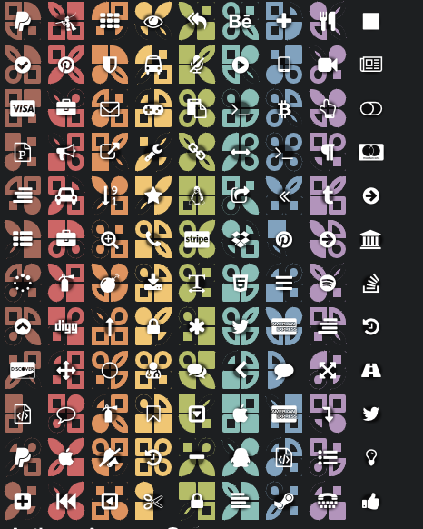

# RecordQue
a visual design language for borders to represent categories and values and reduce/expand ot an icon representation 



```html

<link rel="stylesheet" type="text/css" href="recordQue.css">

<record-que d="{nw:'shape mod color',ne:'shape mod color',sw:'shape mod color',se:'shape mod color', c:'fa-icon color'}"></record-que>

<script type="text/javascript" src="recordQue.js"></script>

```
```javascript

var app = angular.module('AppName', ['ngRecordQue']);

```

## Shapes

Each of the shapes mods and colors have a class

1. Square
2. Pie
3. Leaf
4. Drop

## Mods

1. Cutout : a smaller disconnected version
1. Hollow
1. Solid

## Colors

1. red
2. tomatoe
3. orange
4. yellow
5. green
6. teal
7. blue
8. purple
9. white
